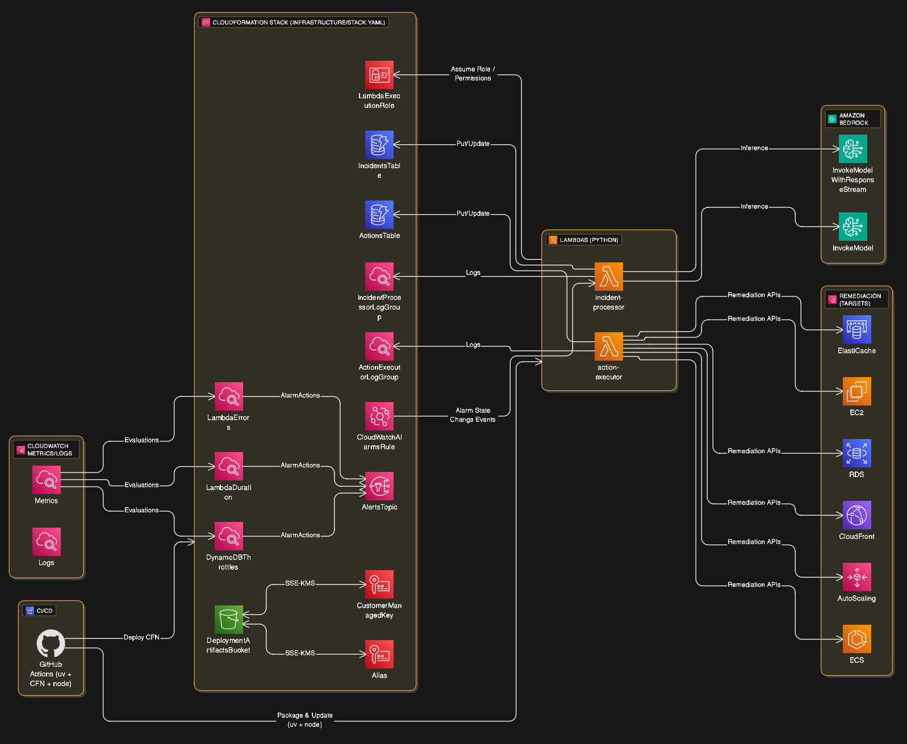

# Intelligent Automation AI Agent for DevOps and Cloud Management

An autonomous AI agent that monitors, detects, diagnoses, and responds to incidents in AWS cloud infrastructure. This agent is powered by LLMs and multi-service integrations in AWS to automatically execute actions that maintain and optimize production environments.

## Architecture Overview

### Core Components
- **Amazon Bedrock**: Core LLM for reasoning and decision-making
- **Amazon Bedrock Agent**: Orchestration for decision flows and autonomous agent
- **AWS CloudWatch**: Real-time monitoring and alerts
- **AWS Lambda & API Gateway**: Automated action execution and communication
- **Amazon Q**: Assistant for historical analysis and troubleshooting
- **Amazon DynamoDB**: Log storage, incidents, and agent context
- **Amazon S3**: Additional storage for logs and artifacts

### Key Features
1. **Intelligent Autoscaling**: Automatic scaling based on load patterns
2. **Self-Diagnosis**: Automatic remediation of microservice failures
3. **Proactive Optimization**: Cost and architecture suggestions
4. **Automated Reporting**: Post-incident reports and dashboards
5. **ChatOps Integration**: Natural language interaction via Slack/Teams

## Project Structure
```
├── src/
│   ├── agents/           # Bedrock Agent implementations
│   ├── integrations/     # AWS service integrations
│   ├── functions/        # Lambda functions
│   ├── monitoring/       # CloudWatch configurations
│   └── utils/           # Shared utilities
├── infrastructure/       # Infrastructure as Code
├── config/              # Configuration files
├── tests/               # Test suites
└── docs/                # Documentation
```

## Getting Started

1. **Prerequisites**:
   - AWS CLI configured with appropriate permissions
   - Python 3.9+
   - Node.js 18+
   - uv (Python package/dependency manager)

2. **Installation**:
   ```bash
   uv pip install -r requirements.txt
   npm install
   ```

3. **Configuration**:
   ```bash
   cp config/config.example.yaml config/config.yaml
   # Edit config.yaml with your AWS settings
   ```

4. **Deployment**:
   Deployment now happens via GitHub Actions with CloudFormation. Push to the default branch or trigger the workflow manually.
   - Application packaging uses uv
   - Infrastructure managed by CloudFormation templates in `infrastructure/`

5. **GitHub Actions OIDC Configuration**:
   The GitHub Actions workflow uses OpenID Connect (OIDC) to securely authenticate with AWS. Before you can deploy, you must configure an IAM OIDC provider in your AWS account and create a role that the workflow can assume.

   For detailed, step-by-step instructions, please follow the guide here:
   [**infrastructure/OIDC_SETUP.md**](./infrastructure/OIDC_SETUP.md)

## Use Cases

### 1. Intelligent Autoscaling
- Monitor application metrics and traffic patterns
- Automatically scale resources based on predicted demand
- Optimize for cost while maintaining performance

### 2. Self-Diagnosis and Remediation
- Detect microservice failures and anomalies
- Automatically restart failed services
- Escalate complex issues to human operators

### 3. Proactive Optimization
- Analyze usage patterns and costs
- Suggest architecture improvements
- Recommend resource right-sizing

### 4. ChatOps Integration
- Query infrastructure status via natural language
- Execute commands through chat interfaces
- Receive real-time incident notifications

## Security Considerations

- All AWS API calls use IAM roles with least privilege
- Secrets managed through AWS Secrets Manager
- All communications encrypted in transit and at rest
- Audit logging enabled for all agent actions

## Contributing

1. Fork the repository
2. Create a feature branch
3. Make your changes
4. Add tests
5. Submit a pull request

## Diagram 


## License

MIT License - see LICENSE file for details
